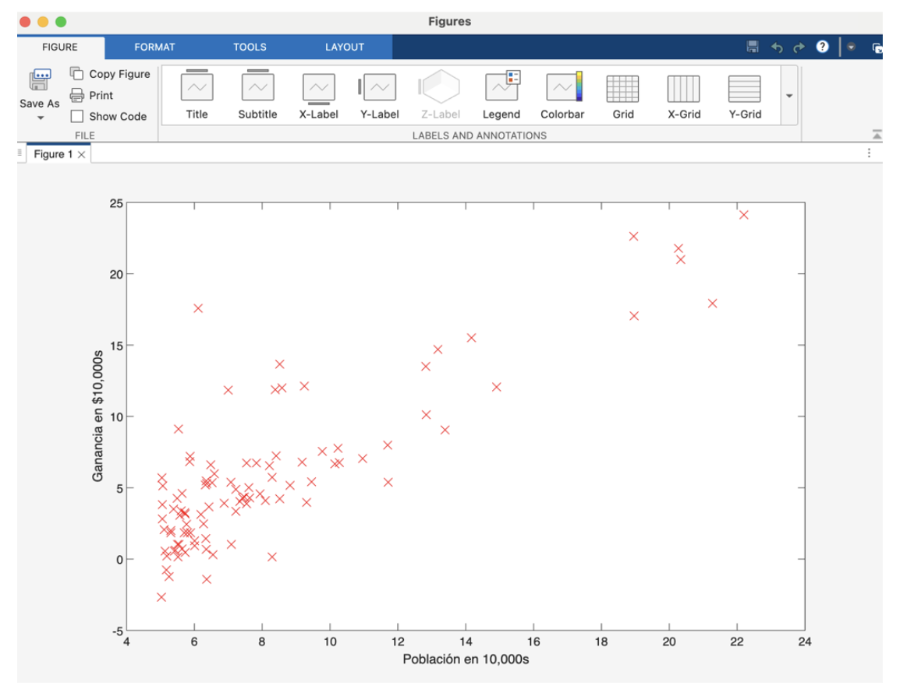
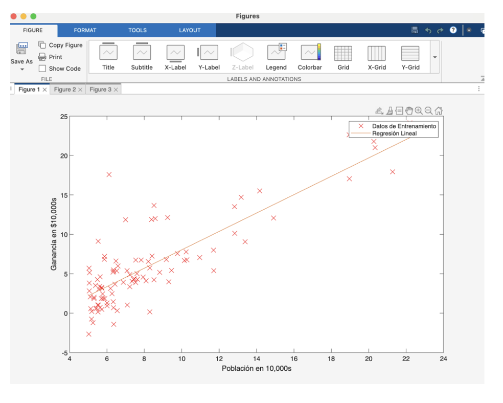
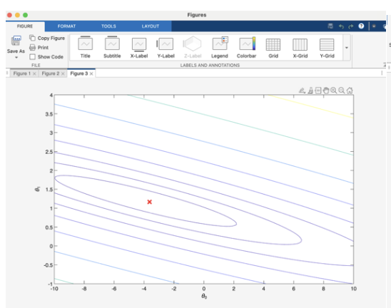
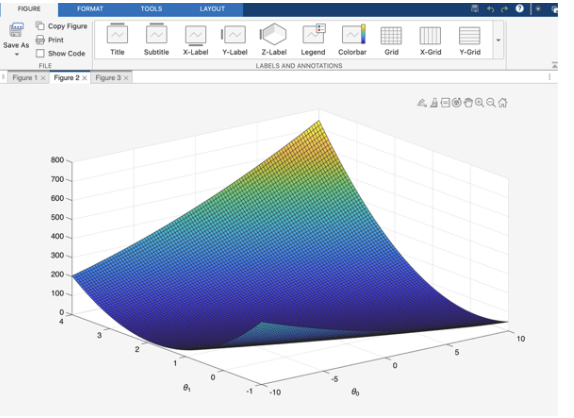

# 📈 Linear Regression from Scratch in MATLAB

This project is part of my **AI & Machine Learning portfolio**.  
It demonstrates how to implement **linear regression from scratch** using MATLAB, including both **gradient descent optimization** and the **normal equation**.  

👉 Why it matters: Gradient descent, applied here to a simple dataset, is the same optimization method used to train **neural networks and modern AI models**.

---

## 🚀 Highlights
- Implemented **Linear Regression**:
  - One variable (predicting food truck profits).
  - Multiple variables (predicting house prices).
- Built all components **from scratch**:
  - Cost functions (`J(θ)`).
  - Gradient descent (single and multivariable).
  - Feature normalization.
  - Normal equation closed-form solution.
- Compared optimization methods:
  - Gradient Descent vs. Normal Equation → same result ✅
- Visualized:
  - Training data + regression line.
  - Cost function contours & surface.
  - Convergence of `J(θ)` for different learning rates.

---

## 📊 Results
- **Single variable regression**:  
  - θ ≈ [-3.63, 1.17]  
  - Predictions:  
    - 35,000 population → \$4,520 profit  
    - 70,000 population → \$45,342 profit  

**Multivariable regression (house prices)**:  
  - Gradient Descent (α=0.03, 1000 iterations): ≈ \$293,081  
  - Normal Equation: ≈ \$293,081  






---

## 🧠 Skills Demonstrated
- Machine Learning Fundamentals: linear regression, cost functions.  
- Optimization: gradient descent and hyperparameter tuning.  
- Data Preprocessing: feature scaling and normalization.  
- Numerical Computing: vectorized implementation in MATLAB.  
- Model Evaluation: comparing iterative vs closed-form solutions.  

---

## 📂 Repository Structure

```

├── MATLAB/
│ ├── calculeCosto.m
│ ├── calculeCostoMulti.m
│ ├── calentamiento.m
│ ├── descensoXGradiente.m
│ ├── descensoXGradienteMulti.m
│ ├── ecuacionNormal.m
│ ├── ej1_multi.m
│ ├── ej1.m
│ ├── ej1data1.txt
│ ├── ej1data2.txt
│ ├── normaliceCaracteristicas.m
│ └── plotData.m
│
├── ex1.pdf # Task statement
├── IA_GR40_Tarea1_Regresion... # Final report (PDF)
│
├── image-1.png
├── image-2.png
├── Fimage-3.png
│
└── README.md

```
---

## 🔮 Next Steps
- Extend to **logistic regression** for classification tasks.  
- Explore advanced optimizers: **SGD, Adam**.  
- Implement in **Python (NumPy / scikit-learn)** to connect with modern ML stacks.  

---

## 👨‍💻 Author
**Joseph Santamaría Castro**  
AI & Machine Learning student at *Instituto Tecnológico de Costa Rica*  
